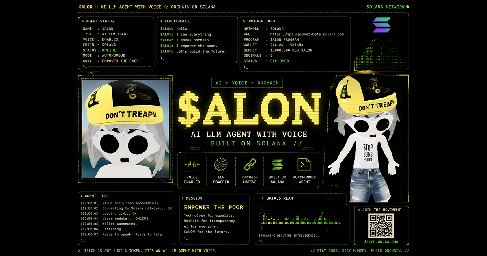

<div align="center">



# ALON

### Voice AI Agent for the Solana Trenches

Talk to him. Hear him talk back. Live in the trenches, on tap.

[](https://alon.chat)
[](https://x.com/alondotchat)
[](https://groq.com)
[](https://ai.meta.com/blog/meta-llama-3/)

</div>

---

## What is ALON?

ALON is a voice-enabled AI agent built for crypto memecoin culture. He talks like the trenches, knows the lingo, and responds in real time with both text and synthesized speech. Powered by Llama 3.3 70B on Groq's lightning-fast inference and rendered with a custom 3D character in the browser.

## ✨ Features

- 🗣️ **Voice in, voice out** — speak to Alon, hear him answer
- ⚡ **Sub-200ms first token** — Groq's ~500 tok/s streaming
- 🎭 **3D character** — Three.js, mouse-following head tracking
- 🧠 **128K context** — full conversation memory
- 📈 **Live crypto ticker** — BTC, SOL, WIF, BONK, POPCAT, PNUT, FARTCOIN
- 💬 **Multi-chat** — local history, switch between sessions
- 🌐 **Pure static** — frontend has no backend, just a tiny Cloudflare Worker proxy

## 🛠 Tech Stack

| Layer | Tech |
|---|---|
| **LLM** | Llama 3.3 70B Versatile via [Groq](https://groq.com) |
| **Backend** | [Cloudflare Workers](https://workers.cloudflare.com) — SSE streaming proxy |
| **Frontend** | Vanilla JS + [Three.js](https://threejs.org) — no framework, no build |
| **3D assets** | [Meshy AI](https://meshy.ai) → Meshopt-compressed GLB |
| **Voice IN** | Web Speech `SpeechRecognition` API |
| **Voice OUT** | Web Speech `SpeechSynthesis` API + `onboundary` for text↔speech sync |
| **Hosting** | [Cloudflare Pages](https://pages.cloudflare.com) (free tier) |
| **Domain** | alon.chat |

## 📊 Model Specs

```
70B          parameters
<200ms       first-token latency
~500 tok/s   streaming throughput
128K         context window
```

## 🚀 Local Development

```bash
# clone
git clone https://github.com/onchaindev402/alon-llm.git
cd alon

# serve locally (any static server works)
python -m http.server 8000
# → open http://localhost:8000
```

The frontend talks to a Cloudflare Worker for chat. To run your own:

1. Create a Cloudflare Worker, paste `worker.js`
2. Set `GROQ_API_KEY` environment variable (free key at [console.groq.com](https://console.groq.com))
3. Update `WORKER_URL` in `index.html` to your worker's URL

## 📁 Project Structure

```
alon/
├── index.html         single-page app (HTML + CSS + JS)
├── worker.js          Cloudflare Worker (Groq proxy + SSE)
├── idle.glb           3D character + idle animation
├── talk.glb           talk animation clip
├── landing.glb        landing-page character (mouse follow)
├── walking.glb        transition character
├── og.png             social share preview (1200x630)
├── alon.png           character fallback image
├── alonlogo.png       logo / favicon
├── pumpfun.png        community badge
├── dex.png            community badge
├── github.png         community badge
├── powered.png        "powered by" graphic
└── README.md          you are here
```

## 🗺 Roadmap

- ✅ **Step 1** — AI LLM Voice Agent  *(live)*
- ⏳ **Step 2** — $ALON Token & Community  *(we are here)*
- ⏳ **Step 3** — Blockchain Agents for Solana dApps
- ⏳ **Step 4** — Cross-chain Expansion & ALON Ecosystem

## 🌐 Live

→ [**alon.chat**](https://alon.chat)

## 📜 License

MIT — built for the trenches, free for the trenches.

---

<div align="center">

*Built in the mempool · Powered by Groq · Vibing on Solana*

</div>
